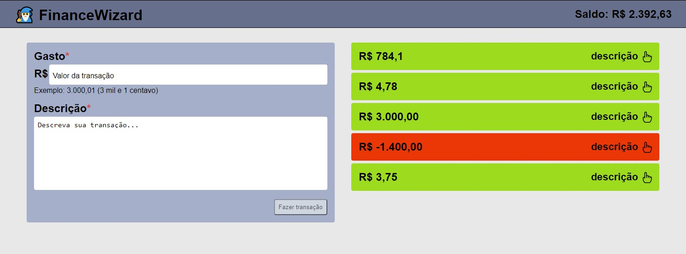

# FinanceWizard

> Simple expenses controller

FinanceWizard is a WebApp made for make your expenses control easier. It's simple to use, interactive, and kinda beautiful (haha).



## Project modeling

- The first step was to decide what technology to use. I wrote what were the project requirements and I decided to go with Nextjs because is the framework that I have been working in the past year and a half. It can serve satic HTML, what CRA does not support and I had a boilerplate that fit the problem (just needed some adjustments)
- After decide the framework, I had to decide how I would built the project. I decided to go first with storybook, to easily see each component isolated and as this project was meant to be open source, having a storybook would be a great feature if the project grew a lot and more and more people contribute to it.
- The next step would be to built the page itself and maybe fix some code
- Then, the final step, once everything is right, it would be to refactor some code in order to make it better and more readable.

## Project links

- [WebApp](https://finance-wizard.vercel.app/)
- [StoryBook](https://carlosberti.github.io/?path=/docs/header--default)

## Installation

First of all you need to have nodejs installed. So, if you don't have it, install with you package manager or download it from [nodejs](https://nodejs.org/en/) and install.

Now that you have nodejs installed, you need to clone this project into your device `https://github.com/carlosberti/financeWizard.git`.

## Getting Started

First, install all dependencies:

```bash
npm install
# or
yarn install
```

Now you are able to run the storybook server:

```bash
npm run storybook
# or
yarn storybook
```

It will open [http://localhost:6006/](http://localhost:6006/) in your browser

To see the WebApp, run the development server:

```bash
npm run dev
# or
yarn dev
```

Open [http://localhost:3000/](http://localhost:3000/) in your browser

## Contributing

If you feel like you have something to add to the project, please read our [Contributing Guide](CONTRIBUTING.md) before submitting a Pull Request.
